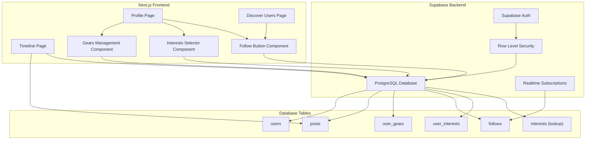
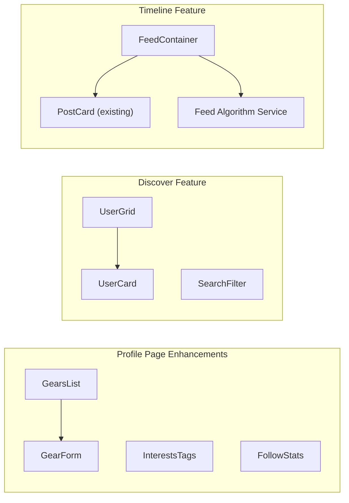
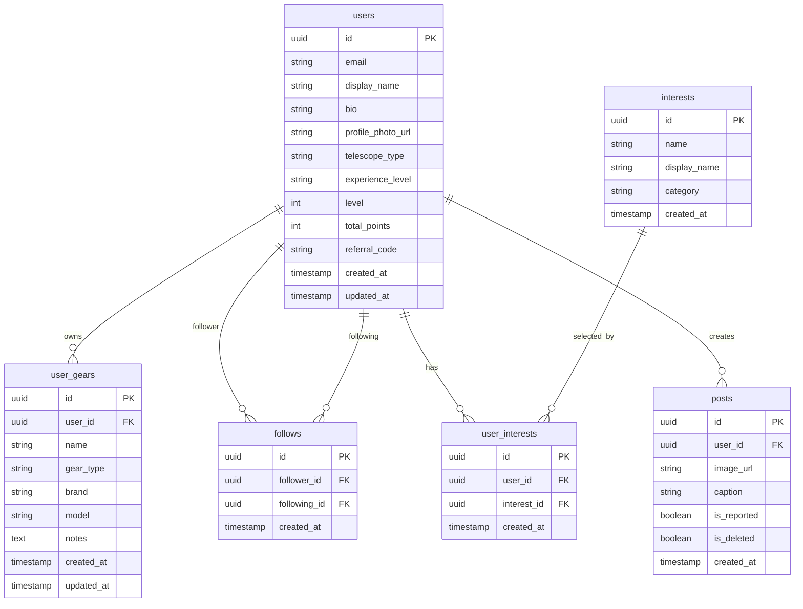
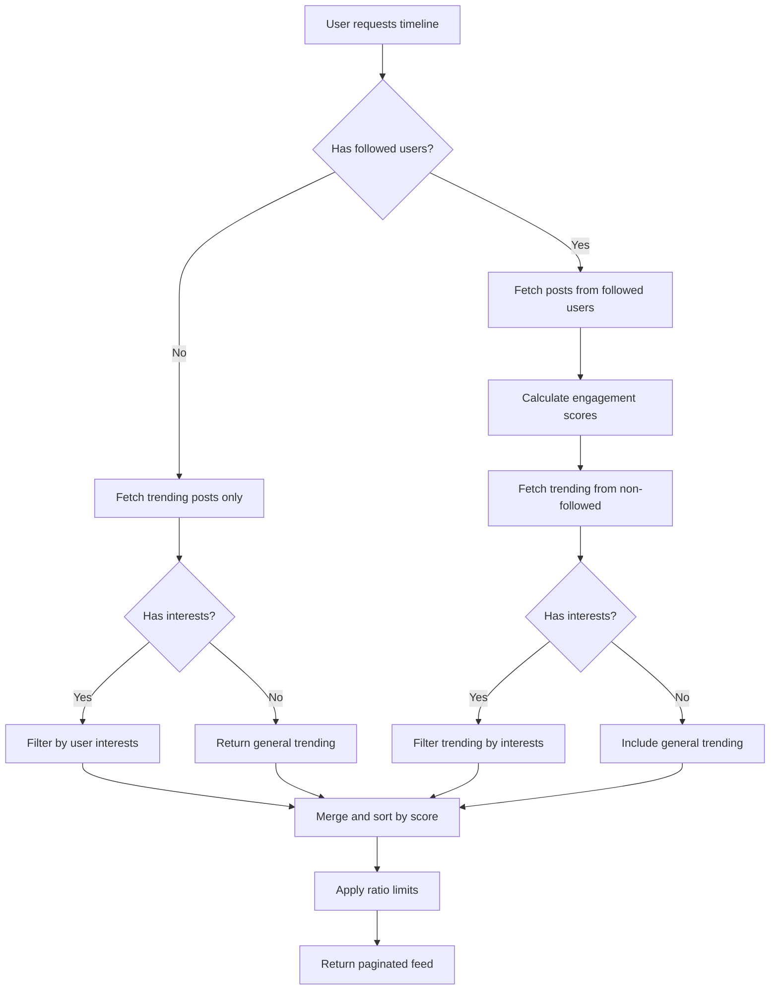

# Design Document: Social Features Enhancement

## Overview

This design document outlines the technical implementation for enhancing the SkyGuild astronomy community app with social features. The enhancement adds four major capabilities: profile gears management, user discovery with follow system, personalized timeline feed, and an interests-based recommendation system.

The implementation leverages the existing Next.js 14 frontend with Supabase backend, extending the current database schema with new tables for gears, follows, and interests while integrating with the existing users and posts tables.

## Architecture



### Component Architecture



## Components and Interfaces

### Database Schema

#### user_gears Table
```sql
CREATE TABLE user_gears (
    id UUID PRIMARY KEY DEFAULT gen_random_uuid(),
    user_id UUID NOT NULL REFERENCES users(id) ON DELETE CASCADE,
    name VARCHAR(255) NOT NULL,
    gear_type VARCHAR(50) NOT NULL CHECK (gear_type IN ('telescope', 'camera', 'mount', 'eyepiece', 'filter', 'accessory')),
    brand VARCHAR(100),
    model VARCHAR(100),
    notes TEXT,
    created_at TIMESTAMP WITH TIME ZONE DEFAULT NOW(),
    updated_at TIMESTAMP WITH TIME ZONE DEFAULT NOW()
);

CREATE INDEX idx_user_gears_user_id ON user_gears(user_id);
```

#### follows Table
```sql
CREATE TABLE follows (
    id UUID PRIMARY KEY DEFAULT gen_random_uuid(),
    follower_id UUID NOT NULL REFERENCES users(id) ON DELETE CASCADE,
    following_id UUID NOT NULL REFERENCES users(id) ON DELETE CASCADE,
    created_at TIMESTAMP WITH TIME ZONE DEFAULT NOW(),
    UNIQUE(follower_id, following_id),
    CHECK (follower_id != following_id)
);

CREATE INDEX idx_follows_follower_id ON follows(follower_id);
CREATE INDEX idx_follows_following_id ON follows(following_id);
```

#### interests Table (Lookup)
```sql
CREATE TABLE interests (
    id UUID PRIMARY KEY DEFAULT gen_random_uuid(),
    name VARCHAR(100) NOT NULL UNIQUE,
    display_name VARCHAR(100) NOT NULL,
    category VARCHAR(50),
    created_at TIMESTAMP WITH TIME ZONE DEFAULT NOW()
);

-- Seed data
INSERT INTO interests (name, display_name, category) VALUES
    ('astrophotography', 'Astrophotography', 'technique'),
    ('deep_sky_objects', 'Deep Sky Objects', 'target'),
    ('planets', 'Planets', 'target'),
    ('moon', 'Moon', 'target'),
    ('sun', 'Sun', 'target'),
    ('meteor_showers', 'Meteor Showers', 'event'),
    ('comets', 'Comets', 'target'),
    ('satellites', 'Satellites', 'target'),
    ('eclipses', 'Eclipses', 'event'),
    ('star_clusters', 'Star Clusters', 'target'),
    ('nebulae', 'Nebulae', 'target'),
    ('galaxies', 'Galaxies', 'target'),
    ('equipment_reviews', 'Equipment Reviews', 'content'),
    ('observation_techniques', 'Observation Techniques', 'technique');
```

#### user_interests Table
```sql
CREATE TABLE user_interests (
    id UUID PRIMARY KEY DEFAULT gen_random_uuid(),
    user_id UUID NOT NULL REFERENCES users(id) ON DELETE CASCADE,
    interest_id UUID NOT NULL REFERENCES interests(id) ON DELETE CASCADE,
    created_at TIMESTAMP WITH TIME ZONE DEFAULT NOW(),
    UNIQUE(user_id, interest_id)
);

CREATE INDEX idx_user_interests_user_id ON user_interests(user_id);
```

### TypeScript Interfaces

```typescript
// types/social.types.ts

export type GearType = 'telescope' | 'camera' | 'mount' | 'eyepiece' | 'filter' | 'accessory';

export interface UserGear {
    id: string;
    user_id: string;
    name: string;
    gear_type: GearType;
    brand: string | null;
    model: string | null;
    notes: string | null;
    created_at: string;
    updated_at: string;
}

export interface Follow {
    id: string;
    follower_id: string;
    following_id: string;
    created_at: string;
}

export interface Interest {
    id: string;
    name: string;
    display_name: string;
    category: string | null;
}

export interface UserInterest {
    id: string;
    user_id: string;
    interest_id: string;
    interest?: Interest;
    created_at: string;
}

export interface UserWithSocialData {
    id: string;
    display_name: string | null;
    profile_photo_url: string | null;
    experience_level: string | null;
    bio: string | null;
    follower_count: number;
    following_count: number;
    is_following?: boolean;
    gears?: UserGear[];
    interests?: Interest[];
}

export interface TimelinePost {
    id: string;
    user_id: string;
    caption: string | null;
    image_url: string;
    created_at: string;
    users: {
        id: string;
        display_name: string | null;
        profile_photo_url: string | null;
    };
    likes_count: number;
    comments_count: number;
    is_liked: boolean;
    is_from_following: boolean;
    engagement_score: number;
}

export interface FeedConfig {
    followedPostsRatio: number;  // 0.7 = 70% from followed users
    trendingPostsRatio: number;  // 0.3 = 30% trending from non-followed
    pageSize: number;
    engagementWeights: {
        likes: number;
        comments: number;
        recency: number;
    };
}
```

### React Components

#### GearsList Component
```typescript
// components/profile/GearsList.tsx
interface GearsListProps {
    userId: string;
    isOwnProfile: boolean;
    gears: UserGear[];
    onGearAdded?: (gear: UserGear) => void;
    onGearUpdated?: (gear: UserGear) => void;
    onGearDeleted?: (gearId: string) => void;
}
```

#### GearForm Component
```typescript
// components/profile/GearForm.tsx
interface GearFormProps {
    gear?: UserGear;  // undefined for new gear
    onSubmit: (data: Omit<UserGear, 'id' | 'user_id' | 'created_at' | 'updated_at'>) => Promise<void>;
    onCancel: () => void;
}
```

#### FollowButton Component
```typescript
// components/social/FollowButton.tsx
interface FollowButtonProps {
    targetUserId: string;
    isFollowing: boolean;
    onFollowChange: (isFollowing: boolean) => void;
    size?: 'sm' | 'md' | 'lg';
}
```

#### UserCard Component
```typescript
// components/social/UserCard.tsx
interface UserCardProps {
    user: UserWithSocialData;
    onFollowChange?: (userId: string, isFollowing: boolean) => void;
}
```

#### InterestsSelector Component
```typescript
// components/profile/InterestsSelector.tsx
interface InterestsSelectorProps {
    selectedInterests: Interest[];
    availableInterests: Interest[];
    onChange: (interests: Interest[]) => void;
    isEditing: boolean;
}
```

### Feed Algorithm Service

```typescript
// lib/services/feedAlgorithm.ts

export interface FeedQuery {
    userId: string;
    userInterests: string[];
    followingIds: string[];
    page: number;
    pageSize: number;
}

export interface FeedResult {
    posts: TimelinePost[];
    hasMore: boolean;
    nextPage: number;
}

export function calculateEngagementScore(
    likesCount: number,
    commentsCount: number,
    createdAt: string,
    weights: FeedConfig['engagementWeights']
): number;

export async function fetchTimelineFeed(
    supabase: SupabaseClient,
    query: FeedQuery,
    config: FeedConfig
): Promise<FeedResult>;
```

## Data Models

### Entity Relationship Diagram



### Feed Algorithm Flow




## Correctness Properties

*A property is a characteristic or behavior that should hold true across all valid executions of a system—essentially, a formal statement about what the system should do. Properties serve as the bridge between human-readable specifications and machine-verifiable correctness guarantees.*

### Property 1: Gear CRUD Round-Trip

*For any* valid gear data (name, type, brand, model, notes), creating a gear record, then retrieving it, should return the same data that was submitted. Similarly, updating a gear and retrieving it should reflect the updates, and deleting a gear should result in it no longer being retrievable.

**Validates: Requirements 1.2, 1.3, 1.4**

### Property 2: Gear Type Validation

*For any* gear type string, the system should accept it if and only if it is one of the valid types (telescope, camera, mount, eyepiece, filter, accessory). Invalid gear types should be rejected.

**Validates: Requirements 1.5**

### Property 3: User Discovery Pagination Completeness

*For any* set of registered users, iterating through all pages of the user discovery endpoint should return exactly all users, with no duplicates and no missing users.

**Validates: Requirements 2.1**

### Property 4: User Search Accuracy

*For any* search query string and set of users, the search results should contain exactly the users whose display names contain the search string (case-insensitive), and no users whose names do not match.

**Validates: Requirements 2.3**

### Property 5: User Filter by Experience Level

*For any* experience level filter and set of users, the filtered results should contain exactly the users with that experience level, and no users with different levels.

**Validates: Requirements 2.4**

### Property 6: Follow State Consistency

*For any* two distinct users A and B, after A follows B, the follow relationship should exist. After A unfollows B, the follow relationship should not exist. The state should be consistent regardless of how many times follow/unfollow is called.

**Validates: Requirements 3.1, 3.2**

### Property 7: Self-Follow Prevention

*For any* user, attempting to create a follow relationship where follower_id equals following_id should fail or be rejected by the system.

**Validates: Requirements 3.3**

### Property 8: Follow Counts Accuracy

*For any* user and any sequence of follow/unfollow operations involving that user, the follower_count should equal the actual count of users following them, and the following_count should equal the actual count of users they follow.

**Validates: Requirements 3.4, 3.5, 3.6**

### Property 9: Is-Following Flag Accuracy

*For any* pair of users (viewer, target), the is_following flag returned when viewing the target's profile should be true if and only if a follow relationship exists from viewer to target.

**Validates: Requirements 3.7**

### Property 10: Feed Algorithm Correctness

*For any* user with followed users and interests, the timeline feed should satisfy:
1. Posts from followed users should have higher priority (appear earlier or have higher scores) than posts from non-followed users with similar engagement
2. The ratio of posts from non-followed users should not exceed 30% of the total feed
3. Posts should be ordered by their engagement score (combination of likes, comments, and recency)

**Validates: Requirements 4.1, 4.2, 4.4, 4.8**

### Property 11: Interest-Based Filtering

*For any* user with selected interests, trending posts from non-followed users in their timeline should only include posts that match at least one of their interests (based on post category or tags).

**Validates: Requirements 4.3, 5.4**

### Property 12: No-Interests Fallback

*For any* user with no selected interests, the timeline should include general trending posts without interest filtering applied.

**Validates: Requirements 4.6, 5.5**

### Property 13: Engagement Score Calculation

*For any* post with known likes_count and comments_count, the engagement score should be calculated consistently using the defined formula (weighted sum of likes, comments, and recency factor).

**Validates: Requirements 4.5**

### Property 14: Interest Persistence Round-Trip

*For any* user and any set of valid interests, saving those interests and then retrieving them should return the exact same set of interests.

**Validates: Requirements 5.1, 5.3, 5.6**

### Property 15: Cascade Delete Correctness

*For any* user with associated gears, follows, and interests, deleting that user should result in all their associated gears, follow relationships (both as follower and following), and interests being deleted as well.

**Validates: Requirements 6.5**

## Error Handling

### Database Errors

| Error Scenario | Handling Strategy |
|----------------|-------------------|
| Foreign key violation (invalid user_id) | Return 400 Bad Request with descriptive message |
| Unique constraint violation (duplicate follow) | Return 409 Conflict, idempotent behavior for UI |
| Self-follow attempt | Return 400 Bad Request with "Cannot follow yourself" message |
| Invalid gear type | Return 400 Bad Request with list of valid types |
| User not found | Return 404 Not Found |
| Database connection failure | Return 503 Service Unavailable, retry with exponential backoff |

### API Error Responses

```typescript
interface ApiError {
    code: string;
    message: string;
    details?: Record<string, unknown>;
}

// Example error codes
const ERROR_CODES = {
    INVALID_GEAR_TYPE: 'INVALID_GEAR_TYPE',
    SELF_FOLLOW_NOT_ALLOWED: 'SELF_FOLLOW_NOT_ALLOWED',
    ALREADY_FOLLOWING: 'ALREADY_FOLLOWING',
    NOT_FOLLOWING: 'NOT_FOLLOWING',
    USER_NOT_FOUND: 'USER_NOT_FOUND',
    UNAUTHORIZED: 'UNAUTHORIZED',
} as const;
```

### Client-Side Error Handling

- Display toast notifications for transient errors
- Show inline validation errors for form inputs
- Implement optimistic updates with rollback on failure
- Cache previous state for recovery on network errors

## Testing Strategy

### Unit Tests

Unit tests will focus on:
- Gear form validation logic
- Engagement score calculation function
- Feed algorithm sorting and filtering logic
- Interest matching logic
- Input sanitization and validation

### Property-Based Tests

Property-based tests will be implemented using `fast-check` library for TypeScript. Each test will run a minimum of 100 iterations.

**Configuration:**
```typescript
import fc from 'fast-check';

const PBT_CONFIG = {
    numRuns: 100,
    verbose: true,
};
```

**Test Organization:**
- Each correctness property from the design document will have a corresponding property-based test
- Tests will be tagged with format: `Feature: social-features, Property N: [property_text]`
- Property tests will generate random valid inputs and verify invariants hold

### Integration Tests

Integration tests will verify:
- Database operations with Supabase client
- Row Level Security policies
- Realtime subscription updates for follow counts
- End-to-end feed generation with real data

### Test Data Generators

```typescript
// Generators for property-based testing
const gearTypeArb = fc.constantFrom('telescope', 'camera', 'mount', 'eyepiece', 'filter', 'accessory');

const gearArb = fc.record({
    name: fc.string({ minLength: 1, maxLength: 255 }),
    gear_type: gearTypeArb,
    brand: fc.option(fc.string({ maxLength: 100 })),
    model: fc.option(fc.string({ maxLength: 100 })),
    notes: fc.option(fc.string({ maxLength: 1000 })),
});

const userIdArb = fc.uuid();

const followRelationshipArb = fc.record({
    follower_id: userIdArb,
    following_id: userIdArb,
}).filter(({ follower_id, following_id }) => follower_id !== following_id);
```
